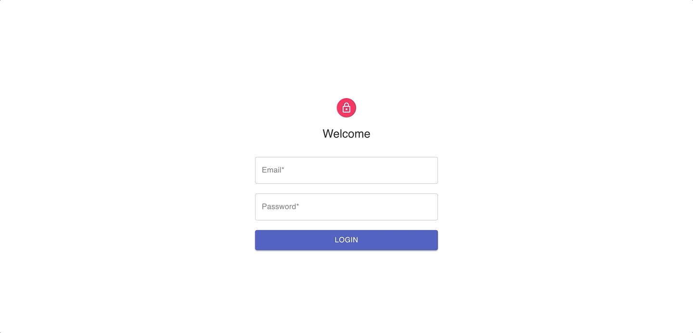
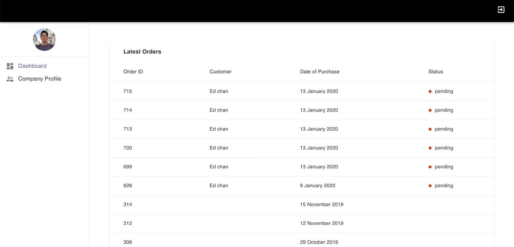
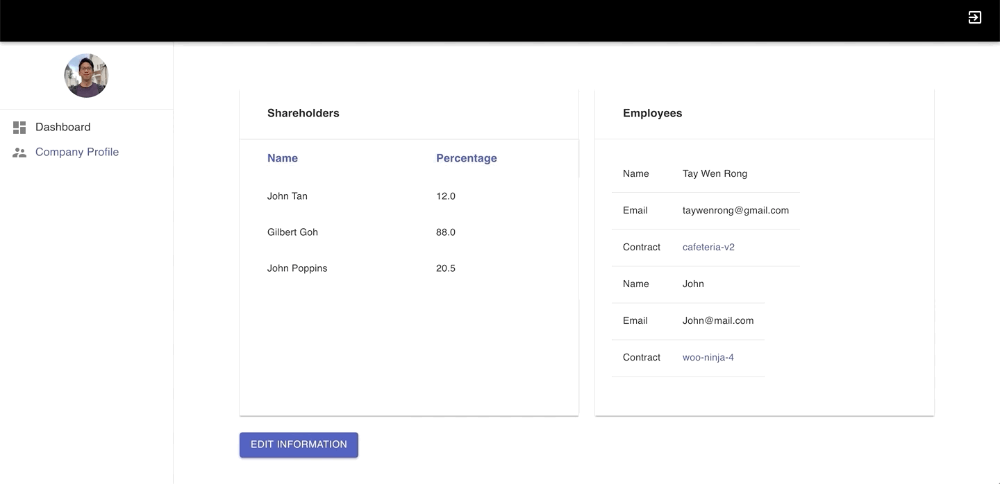

# Company Profile App

A modern React + WordPress based SPA that allows companies to handle internal information i.e., Company Name, Shareholders, Directors, Employees.

Utilises JWT for authentication, [React Router](https://reacttraining.com/react-router/web/guides/quick-start) for routing, [Axios](https://github.com/axios/axios) for HTTP request and [MaterialUI](https://material-ui.com/) for styling.

Uses Context API for global state management and Hooks for local state management.

### Prerequisites

- [NerbCRMWP Plugin](https://github.com/edmundcwm/nerbcrmwp)

### Modules

#### Login

#### Dashboard
The Dashboard module displays all the user's WooCommerce orders. 

#### Company Profile
Company profile contains two profile sections - Shareholders and Employees. Shareholder includes information like name and percentage. Employees include information like name, email and contract(file upload).

##### Add data

##### Edit data

##### Delete data
